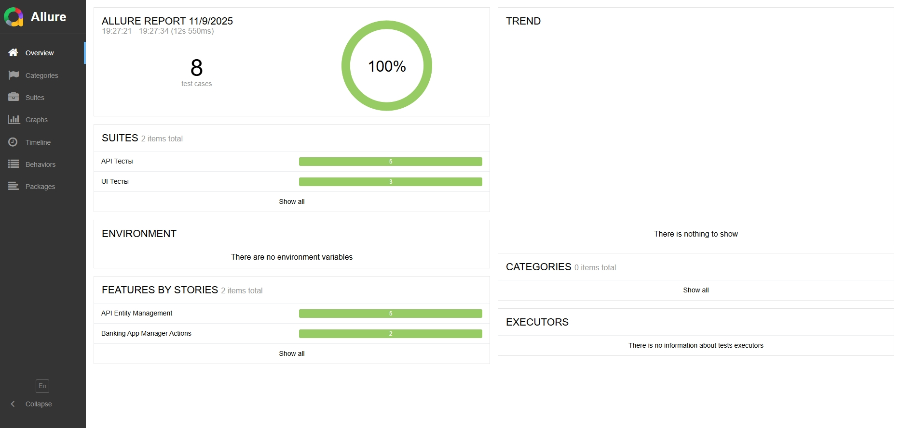
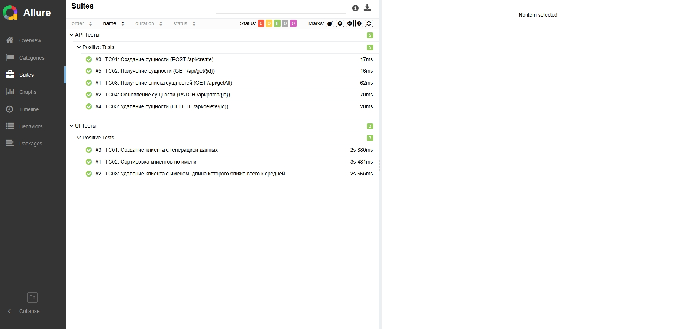
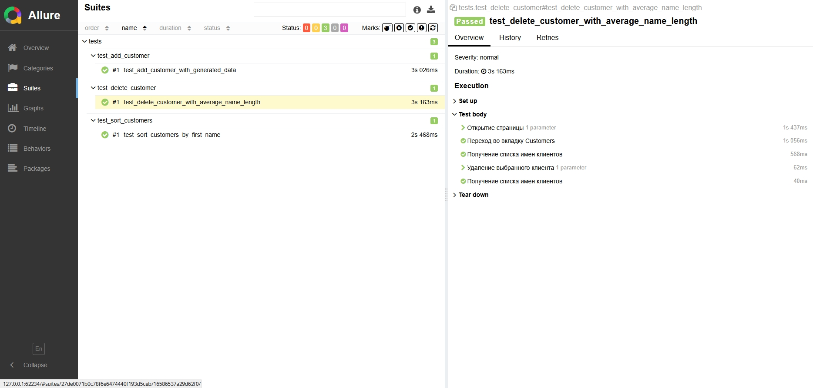

## UI-Тесты для банковского приложения

Этот репозиторий содержит проект автоматизированных UI-тестов, выполненный в рамках задания SDET.

---

## Технологии

*   **Язык программирования:** Python 3.10+
*   **Фреймворк для UI-тестов:** Selenium WebDriver
*   **Браузер:** Chrome (управление драйвером через `webdriver-manager`)
*   **Тестовый фреймворк:** pytest
*   **Сборка зависимостей:** pip (файл `requirements.txt`)
*   **Отчёты:** Allure (доп. задание №1)
*   **Параллельный запуск:** pytest-xdist (доп. задание №2)

---

## Структура проекта

```
project_root/
├── README.md                     # Этот файл
├── .gitignore                    # Файл управления Git
├── requirements.txt              # Список зависимостей Python
├── pytest.ini                    # Конфигурация pytest
├── conftest.py                   # Фикстуры pytest
├── screenshots/                  # Скриншоты для README
├── tests/                        # Папка с тестами
│   ├── __init__.py            
│   ├── test_add_customer.py      # Тест для создания клиента (TC01)
│   ├── test_sort_customers.py    # Тест для сортировки клиентов (TC02)
│   └── test_delete_customer.py   # Тест для удаления клиента (TC03)
├── pages/                        # Папка для POM
│ ├── __init__.py
│ ├── manager_page.py             # Page Object для страницы менеджера
│ └── manager_page_locators.py    # Локаторы элементов страницы менеджера
├── utils/                        # Папка для вспомогательных функций
│   ├── __init__.py
│   ├── data_generator.py         # Функции генерации данных (Post Code, First Name)
│   ├── list_calculator.py        # Функции вычислений (средняя длина, ближайшее имя)
│   └── config.py                 # Файл конфигурации
└── allure_results/               # Папка результатов Allure
```
---

## Установка и запуск

### Виртуальное окружение

1.  Создайте виртуальное окружение:
    ```bash
    python -m venv venv
    ```
2.  Активируйте его:
    *   **Windows:**
        ```bash
        venv\Scripts\activate
        ```
    *   **macOS/Linux:**
        ```bash
        source venv/bin/activate
        ```

### Установка зависимостей

После активации виртуального окружения установите зависимости из файла `requirements.txt`:

```bash
pip install -r requirements.txt
```

---

## Запуск тестов

- Для запуска всех тестов используйте команду `pytest`:

    ```bash
    pytest
    ```

- Для более подробного вывода:

    ```bash
    pytest -v
    ```

- Пример 1 запуска с параметрами (доп. задание №2 - параллельный запуск):

    ```bash
    pytest -n 3 -v
    ```

- Пример 2 запуска с параметрами (с маркером высокого приоритета):

    ```bash
    pytest -m high
    ```

---

## Генерация отчета Allure

1. Запустите тесты, указав директорию для результатов Allure:

    ```bash
    pytest --alluredir=./allure_results
    ```
   
2. Сгенерируйте и откройте HTML-отчет:

    ```bash
    allure serve allure_results
    ```

---

## Тест-кейсы

### Тест-кейс №01. Создание клиента с генерацией данных (`Add Customer`)

- **Предусловие**:
  1. Открыть браузер
  2. Перейти по ссылке: https://www.globalsqa.com/angularJs-protractor/BankingProject/#/manager
  3. Перейти во вкладку `Add Customer`

- **Шаги**:
  1. Сгенерировать случайный 10-значный цифровой `Post Code` (например, `0001252667`)
  2. На основе сгенерированного `Post Code` сформировать `First Name` по следующей логике:
     - Разбить `Post Code` на пары цифр: `00`, `01`, `25`, `26`, `67`
     - Каждую пару интерпретировать как число. Если число > 25, использовать остаток от деления на 26 
     (например, `26 -> 0`, `67 -> 15`)
     - Преобразовать каждое число (0-25) в соответствующую букву алфавита (`0` -> 'a', `1` -> 'b', ..., `25` -> 'z')
     - Склеить полученные буквы. Пример: `00` (a), `01` (b), `25` (z), `26` (a), `67` (p) -> `abzap`)
  3. Ввести сгенерированное имя в поле `First Name`
  4. Ввести сгенерированный `Post Code` в поле `Post Code`.
  5. Ввести произвольное значение в поле `Last Name` (например, `Test`).
  6. Нажать кнопку `Add Customer`.

- **Ожидаемый результат**: 
  1. Появился **алерт** с текстом `Customer added successfully with customer id :*`
  2. Новый клиент с введёнными `First Name`, `Last Name` и `Post Code` отображается в таблице во вкладке `Customers`

- **Приоритет**: высокий

### Тест-кейс №02. Сортировка клиентов по имени (`First Name`)

- **Предусловие**:
  1. Открыть браузер
  2. Перейти по ссылке: https://www.globalsqa.com/angularJs-protractor/BankingProject/#/manager
  3. Перейти во владку `Customers`
  4. В таблице `Customers` присутствует более одного клиента

- **Шаги**:
  1. Запомнить текущий порядок имён в столбце `First Name`
  2. Нажать на заголовок столбца `First Name`
  3. Проверить, что список клиентов теперь отсортирован по `First Name` в обратном алфавитном порядке (Z-A)
  4. Нажать снова на заголовок столбца `First Name`
  5. Проверить, что список клиентов теперь отсортирован по `First Name` в алфавитном порядке (A-Z)

- **Ожидаемый результат**: 
  1. После первого клика по заголовку `First Name` имена сортируются в `обратном алфавитном порядке` (Z-A)
  2. После второго клика по заголовку `First Name` имена сортируются в `алфавитном порядке` (A-Z)

- **Приоритет**: средний

### Тест-кейс №03. Удаление клиента с именем, длина которого ближе всего к средней

- **Предусловие**:
  1. Открыть браузер
  2. Перейти по ссылке: https://www.globalsqa.com/angularJs-protractor/BankingProject/#/manager
  3. Перейти во владку `Customers`
  4. В таблице `Customers` присутствует более одного клиента

- **Шаги**:
  1. Получить список всех имён из столбца `First Name` в таблице `Customers`
  2. Вычислить длину каждого имени из списка
  3. Найти среднее арифметическое всех длин имён
  4. Определить имя, длина которого имеет минимальную разницу со средним арифметическим
  5. Найти строку в таблице, соответствующую этому имени
  6. Нажать кнопку `Delete` в этой строке

- **Ожидаемый результат**: клиент с именем, длина которого была ближе всего к средней, исчезает из таблицы `Customers`

- **Приоритет**: высокий

## Allure отчет






